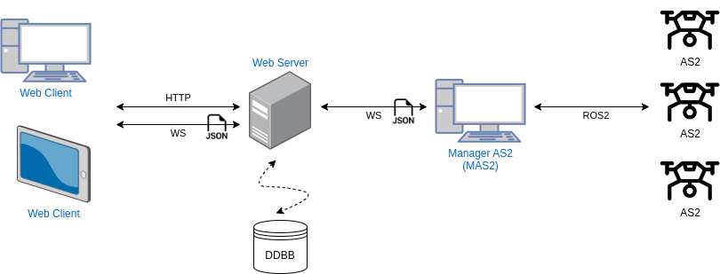
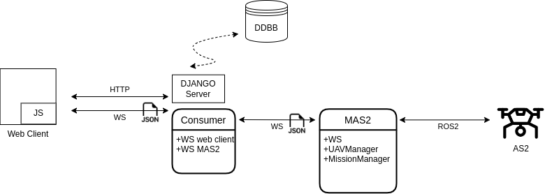
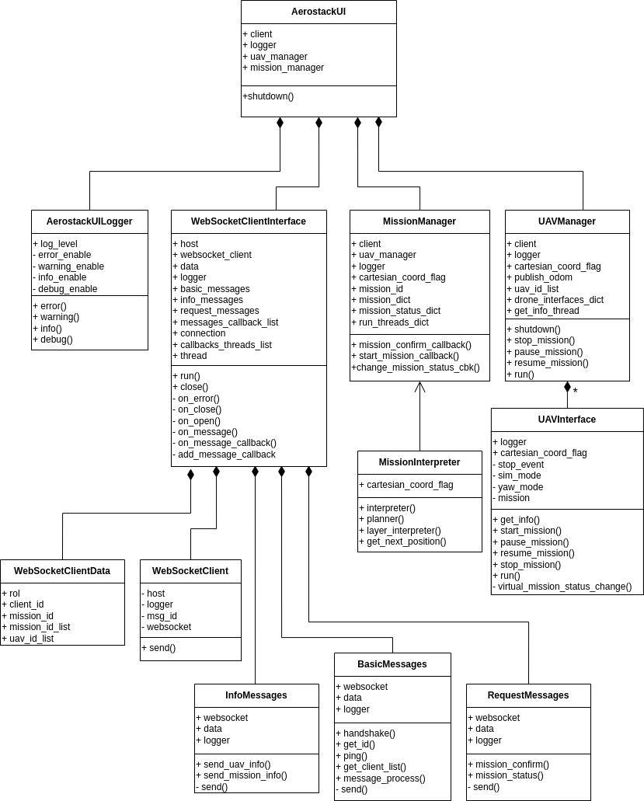

# Aerostack2 Web GUI Architecture

Below is the architecture of the Aerostack2 Web GUI. The Web GUI is a web-based interface that allows users to interact with the Aerostack2 system. The Web GUI is built using Django, a high-level Python web framework. The Web GUI communicates with the Aerostack2 system using a WebSocket connection.

The Web GUI is composed of the following components:

* **Comunication Overview**: The figures below show the communication overview between the Web GUI and the Aerostack2 system. The Web GUI communicates with the Aerostack2 system using ROS 2, and communicates with the user using a web interface.

* **AS2 Web GUI Diagram**: The figure below show the class diagram of the Aerostack2UI, that is the python module that implements the communication between the Web GUI and the Aerostack2 system.

